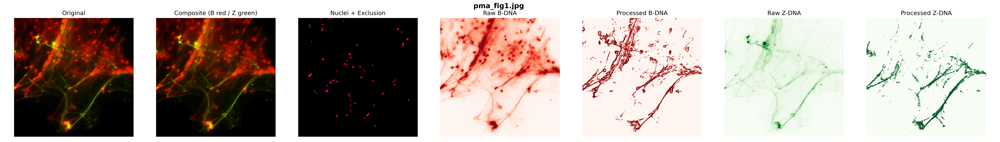

# NET DNA Analysis Pipeline

This repository contains the image analysis pipeline used to quantify structural and compositional properties of NET DNA, including Z-DNA.

## Run

```bash
pip install -r requirements.txt
python run_analysis.py --input data/ --output results.csv
```

Input - 

Multichannel images with: 
Channel 0: B-DNA\
Channel 1: Z-DNA\
Channel 2: ZBP1\
Channel 3: MITO\
Channel 4: 8oxoG (optional)


Key Metrics -
Z_num_domains, Z_efficiency\
Z_independent_fraction\
Z_mito_fraction\
ZBP1 colocalization\
8oxoG overlap metrics

Notes

Skeleton-based metrics capture structural organization of DNA, while intensity-based metrics capture signal composition.

## Example Output


